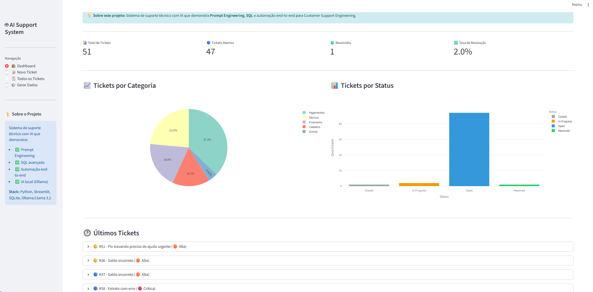

# 🤖 AI-Powered Support System

> Sistema inteligente de suporte técnico com IA local, demonstrando **Prompt Engineering**, **SQL** e automação end-to-end para Customer Support Engineering.


---

## 📋 Índice

- [Sobre o Projeto](#-sobre-o-projeto)
- [Demonstração](#-demonstração)
- [Funcionalidades](#-funcionalidades)
- [Tecnologias Utilizadas](#-tecnologias-utilizadas)
- [Arquitetura](#-arquitetura)
- [Instalação](#-instalação)
- [Como Usar](#-como-usar)
- [Prompt Engineering](#-prompt-engineering)
- [SQL e Banco de Dados](#-sql-e-banco-de-dados)
- [Roadmap](#-roadmap)
- [Contribuindo](#-contribuindo)
- [Licença](#-licença)
- [Contato](#-contato)

---

## 🎯 Sobre o Projeto

O **AI-Support System** é um sistema de tickets de suporte técnico que utiliza Inteligência Artificial local para automatizar e otimizar o atendimento ao cliente em empresas de pagamentos.

### Problema Resolvido

Em empresas de pagamentos digitais, o volume de tickets de suporte pode ser imenso. Este sistema:

✅ **Categoriza automaticamente** tickets usando IA (Prompt Engineering)  
✅ **Prioriza** baseado na urgência detectada  
✅ **Sugere respostas** contextualizadas e personalizadas  
✅ **Busca soluções similares** no histórico usando SQL  
✅ **Registra tudo** para análise e melhoria contínua  

### Diferencial

- **100% Gratuito**: Usa IA local (Ollama) sem custos de API
- **Prompt Engineering Real**: 5 técnicas diferentes aplicadas
- **SQL Avançado**: Queries complexas, buscas semânticas
- **End-to-End**: Solução completa do ticket ao dashboard

---

## 🎥 Demonstração

### Dashboard Principal

*Visão geral com estatísticas, gráficos e tickets recentes*

### Análise com IA

*IA categorizando ticket e gerando resposta automática*

### Gestão de Tickets

*Lista completa com filtros e ações*

---

## ✨ Funcionalidades

### 🤖 Inteligência Artificial

- **Categorização Automática**: IA analisa o problema e classifica em categorias
- **Detecção de Prioridade**: Identifica urgência baseada no tom e conteúdo
- **Geração de Respostas**: Cria respostas empáticas e acionáveis
- **Extração de Keywords**: Identifica palavras-chave para busca
- **Análise de Sentimento**: Detecta emoção do cliente (frustração, urgência)

### 📊 Dashboard e Analytics

- **Métricas em Tempo Real**: Total de tickets, taxa de resolução, etc.
- **Gráficos Interativos**: Distribuição por categoria e status
- **Tickets Recentes**: Lista dos últimos atendimentos
- **Filtros Avançados**: Por status, categoria, data

### 🔍 Busca e Gestão

- **Base de Conhecimento**: Soluções para problemas comuns
- **Busca Semântica**: Encontra tickets similares usando SQL + IA
- **Histórico Completo**: Rastreabilidade de todas as ações
- **Status Management**: Atualização de tickets (Aberto → Resolvido)

### 🎲 Dados Sintéticos

- **Gerador de Tickets**: Cria dados realistas para demonstração
- **Problemas Variados**: Pagamentos, técnico, financeiro, cadastro
- **Nomes e Emails**: Dados brasileiros usando Faker

---

## 🛠️ Tecnologias Utilizadas

- **Python 3.13**: Linguagem principal
- **Streamlit 1.52**: Interface web interativa
- **SQLite 3**: Banco de dados relacional
- **Ollama + Llama 3.2**: IA local gratuita

### Bibliotecas

- **Pandas**: Manipulação de dados
- **Plotly**: Gráficos interativos
- **Faker**: Geração de dados sintéticos
- **ollama-python**: Cliente para Ollama

---

## 🏗️ Arquitetura

```
ai-support-system/
│
├── app.py                 # Interface Streamlit (View)
├── database.py            # Camada de dados SQLite (Model)
├── ai_engine.py           # Motor de IA e Prompt Engineering
├── data_generator.py      # Gerador de dados sintéticos
├── requirements.txt       # Dependências Python
├── README.md             # Documentação
└── .gitignore            # Arquivos ignorados

Banco de Dados (SQLite):
├── tickets               # Tickets de suporte
├── knowledge_base        # Base de conhecimento
├── ai_history           # Histórico de ações da IA
└── suggested_responses   # Respostas sugeridas
```

### Fluxo de Dados

```
1. Cliente envia ticket
   ↓
2. Sistema salva no SQLite (database.py)
   ↓
3. IA analisa com Prompt Engineering (ai_engine.py)
   ↓
4. SQL busca tickets similares (database.py)
   ↓
5. IA gera resposta contextualizada (ai_engine.py)
   ↓
6. Interface exibe resultados (app.py)
   ↓
7. Agente aprova e envia (database.py)
```

---

## 🚀 Instalação

### Pré-requisitos

- Python 3.11+ instalado
- Git instalado
- 2GB de espaço livre (para modelo de IA)

### Passo 1: Clone o Repositório

```bash
git clone https://github.com/AllysonGs/ai-support-system.git
cd ai-support-system
```

### Passo 2: Crie Ambiente Virtual

```bash
python -m venv venv

# Windows
venv\Scripts\activate

# Linux/Mac
source venv/bin/activate
```

### Passo 3: Instale Dependências

```bash
pip install -r requirements.txt
```

### Passo 4: Instale Ollama

#### Windows:
1. Baixe: https://ollama.com/download
2. Execute o instalador
3. Ollama inicia automaticamente

#### Linux:
```bash
curl -fsSL https://ollama.com/install.sh | sh
```

#### Mac:
```bash
brew install ollama
```

### Passo 5: Baixe o Modelo de IA

```bash
ollama pull llama3.2
```

*Aguarde o download (~2.0GB)*

### Passo 6: Teste a Instalação

```bash
# Teste banco de dados
python database.py

# Teste IA
python ai_engine.py

# Teste gerador de dados
python data_generator.py
```

Se todos passarem com ✅, está pronto!

---

## 💻 Como Usar

### Iniciar o Sistema

```bash
streamlit run app.py
```

O sistema abrirá automaticamente em: `http://localhost:8501`

### Passo a Passo

#### 1. Popular com Dados

- Clique em **🎲 Gerar Dados** no menu lateral
- Escolha quantidade (ex: 50 tickets)
- Marque "Categorizar automaticamente"
- Clique em **Gerar Tickets Sintéticos**

#### 2. Explorar Dashboard

- Acesse **🏠 Dashboard**
- Veja estatísticas gerais
- Analise gráficos de distribuição
- Navegue pelos tickets recentes

#### 3. Criar Novo Ticket

- Acesse **📝 Novo Ticket**
- Preencha os dados do cliente
- Descreva o problema
- Clique em **🤖 Criar e Analisar com IA**

**A IA irá:**
- Categorizar automaticamente
- Determinar prioridade
- Extrair palavras-chave
- Buscar soluções similares
- Gerar resposta sugerida

#### 4. Gerenciar Tickets

- Acesse **📋 Todos os Tickets**
- Use filtros (Status, Categoria)
- Clique em tickets para expandir
- Use ações: Resolver, Fechar, etc.

---

## 🧠 Prompt Engineering

Este projeto demonstra **5 técnicas de Prompt Engineering** aplicadas:

### 1. Categorização com Role Definition

```python
system_prompt = """Você é um assistente especializado em suporte técnico de fintech.
Sua função é analisar tickets de clientes e categorizá-los com precisão.

CATEGORIAS DISPONÍVEIS:
- Pagamentos
- Cadastro
- Técnico
- Financeiro
- Outros

RESPONDA APENAS NO FORMATO JSON...
"""
```

**Técnicas usadas:**
- ✅ Role definition (definir papel)
- ✅ Clear constraints (restrições claras)
- ✅ Output format specification (formato específico)

### 2. Geração de Resposta com Context Injection

```python
# RAG - Retrieval Augmented Generation
context = "SOLUÇÕES CONHECIDAS:\n"
for solution in similar_solutions:
    context += f"- {solution}\n"

system_prompt = f"""Você é especialista em Customer Support...
{context}
ESTRUTURA DA RESPOSTA:
1. Cumprimento
2. Compreensão do problema
3. Solução passo a passo...
"""
```

**Técnicas usadas:**
- ✅ Context injection (injeção de contexto)
- ✅ Few-shot learning (exemplos)
- ✅ Structured output (saída estruturada)

### 3. Extração de Keywords

```python
system_prompt = """Extraia palavras-chave relevantes.
REGRAS:
- APENAS as palavras, separadas por vírgula
- Máximo de 5 palavras
- Sem artigos ou conectivos
"""
```

**Técnicas usadas:**
- ✅ Task-specific prompting
- ✅ Output constraints

### 4. Matching Semântico

```python
system_prompt = """Analise o problema e identifique soluções relevantes.
RESPONDA APENAS com os NÚMEROS, separados por vírgula.
Exemplo: 1,3,5
"""
```

**Técnicas usadas:**
- ✅ Semantic search via LLM
- ✅ Constrained generation

### 5. Análise de Sentimento

```python
system_prompt = """Analise o sentimento/tom emocional.
RESPONDA NO FORMATO JSON:
{
    "sentiment": "positivo/neutro/negativo/urgente",
    "emotion": "feliz/frustrado/irritado/preocupado",
    "urgency_score": 1-10
}
"""
```

**Técnicas usadas:**
- ✅ Sentiment analysis
- ✅ Structured JSON output

---

## 💾 SQL e Banco de Dados

### Schema do Banco

```sql
-- Tickets de suporte
CREATE TABLE tickets (
    id INTEGER PRIMARY KEY,
    customer_name TEXT,
    customer_email TEXT,
    subject TEXT,
    description TEXT,
    category TEXT,
    priority TEXT,
    status TEXT,
    created_at TIMESTAMP,
    updated_at TIMESTAMP
);

-- Base de conhecimento
CREATE TABLE knowledge_base (
    id INTEGER PRIMARY KEY,
    title TEXT,
    category TEXT,
    problem_description TEXT,
    solution TEXT,
    keywords TEXT
);

-- Histórico de ações da IA
CREATE TABLE ai_history (
    id INTEGER PRIMARY KEY,
    ticket_id INTEGER,
    action_type TEXT,
    input_data TEXT,
    output_data TEXT,
    confidence_score REAL
);
```

### Queries SQL Utilizadas

#### Busca de Tickets Similares
```sql
SELECT * FROM tickets 
WHERE (description LIKE '%pix%' OR subject LIKE '%pix%')
  AND (description LIKE '%erro%' OR subject LIKE '%erro%')
  AND status = 'Resolved'
ORDER BY created_at DESC
LIMIT 5;
```

#### Estatísticas por Categoria
```sql
SELECT category, COUNT(*) as count 
FROM tickets 
WHERE category IS NOT NULL
GROUP BY category
ORDER BY count DESC;
```

#### Taxa de Resolução
```sql
SELECT 
    COUNT(CASE WHEN status = 'Resolved' THEN 1 END) * 100.0 / COUNT(*) 
    as resolution_rate
FROM tickets;
```

---

## 🗺️ Roadmap

### ✅ Versão 1.0 (Atual)
- [x] Sistema de tickets completo
- [x] IA com 5 técnicas de prompt engineering
- [x] Dashboard com gráficos
- [x] Base de conhecimento
- [x] Gerador de dados sintéticos

---

## 🤝 Contribuindo

Contribuições são bem-vindas! Para contribuir:

1. Fork o projeto
2. Crie uma branch (`git checkout -b feature/NovaFeature`)
3. Commit suas mudanças (`git commit -m 'Add: Nova feature'`)
4. Push para a branch (`git push origin feature/NovaFeature`)
5. Abra um Pull Request

### Padrões de Código

- Use type hints em Python
- Docstrings em todas as funções
- Siga PEP 8
- Adicione testes quando possível

---

## 📄 Licença

Este projeto está sob a licença MIT. Veja o arquivo [LICENSE](LICENSE) para mais detalhes.

---

## 📚 Recursos Adicionais

### Documentação
- [Ollama Documentation](https://ollama.com/docs)
- [Streamlit Docs](https://docs.streamlit.io)
- [SQLite Tutorial](https://sqlite.org/docs.html)

### Artigos Relacionados
- [Prompt Engineering Guide](https://www.promptingguide.ai)
- [Customer Support Best Practices](https://example.com)
- [FinTech Support Automation](https://example.com)

---

## 🤖 Desenvolvimento com IA

Este projeto foi desenvolvido utilizando **Claude (Anthropic)** como assistente de desenvolvimento, 
demonstrando habilidades práticas de:

- **Prompt Engineering para Desenvolvimento**: Utilização de IA como ferramenta produtiva
- **Code Review Assistido**: Otimização e boas práticas sugeridas por IA
- **Documentação Acelerada**: Geração de documentação clara e completa
- **Debugging Inteligente**: Resolução de problemas com assistência de IA


<div align="center">

Made with ❤️ and 🤖 by Allyson Garcia Silva

</div>
